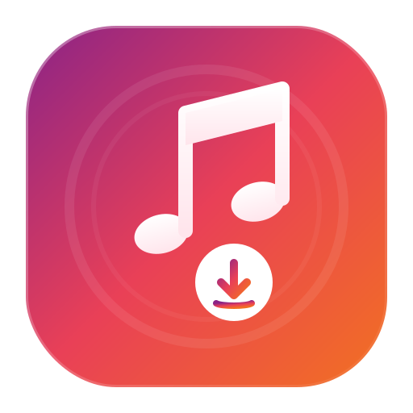

# 🎵 Music Downloader

<p align="center">
  
</p>

<p align="center">
  <strong>Ứng dụng Android mã nguồn mở tải nhạc và video từ YouTube/TikTok trực tiếp, sạch sẽ và không quảng cáo.</strong>
</p>

---

## 🌟 Giới thiệu

**Music Downloader** là một ứng dụng Android native được viết hoàn toàn bằng **Kotlin**, **Jetpack Compose** và **Material 3**. Ứng dụng tích hợp trực tiếp thư viện `youtubedl-android` (chạy `yt-dlp` và `ffmpeg` qua JNI và Python runtime ngay trên thiết bị) để tải nội dung offline chất lượng cao mà không cần thông qua máy chủ trung gian, đảm bảo tốc độ tối đa và quyền riêng tư tuyệt đối cho người dùng.

Với giao diện được thiết kế theo phong cách **Glassmorphism (kính mờ)** hiện đại và sang trọng, ứng dụng mang lại trải nghiệm tương tác trực quan và mượt mà.

---

## 🚀 Tính năng nổi bật

- **Tải trọn bộ Playlist YouTube:**
  - Hỗ trợ phân tích và tải toàn bộ danh sách phát (Playlist) từ YouTube bằng link trực tiếp hoặc link video nằm trong danh sách phát.
  - Tự động hiển thị thông tin playlist (tên danh sách, số lượng video, người tạo).
  - Tải tuần tự (sequential download) toàn bộ danh sách thông qua dịch vụ chạy ngầm (Foreground Service).
  - Trực quan hóa tiến trình tải hàng loạt theo dạng "Đang tải video X trên Y" (Downloading item X of Y) đồng bộ thời gian thực trên giao diện và thanh thông báo.
- **Tải đa dạng định dạng:**
  - **M4A Audio:** Tải nhạc chất lượng cao và tự động tải ảnh bìa (Cover Art) từ video nguồn, sau đó nhúng trực tiếp vào metadata của file âm thanh.
  - **Video (1080p, 720p, Best Quality):** Tải video độ phân giải cao, tự động ghép hình và tiếng chất lượng cao nhất bằng FFmpeg nội bộ.
- **Tự động nhúng Cover Art:** Tự động tải thumbnail của video YouTube/TikTok và ghi đè vào file nhạc giúp hiển thị ảnh bìa cực đẹp khi nghe nhạc trên các ứng dụng phát nhạc.
- **Không quảng cáo & Không server trung gian:** Toàn bộ quá trình xử lý, chuyển đổi định dạng và download diễn ra cục bộ trực tiếp trên điện thoại của bạn.
- **Cơ chế tự sửa lỗi ("Update Engine"):** Khi YouTube thay đổi thuật toán làm lỗi tải, bạn chỉ cần bấm nút cập nhật để tải phiên bản `yt-dlp` mới nhất trực tiếp trong ứng dụng mà không cần chờ cập nhật phiên bản app mới.
- **Tiến trình tải chi tiết:** Hiển thị thời gian thực phần trăm tải (%), tốc độ tải (MB/s), và thời gian dự kiến hoàn thành (ETA).
- **Clipboard Auto-Paste:** Tự động phát hiện liên kết YouTube/TikTok hợp lệ từ khay nhớ tạm (clipboard) khi mở app và hiển thị banner gợi ý dán nhanh.
- **Background Service & Notification:** Hỗ trợ chạy ngầm để tải file ngay cả khi bạn thoát app hoặc khóa màn hình, có hiển thị thanh tiến trình trực tiếp trên thanh thông báo.
- **Quản lý thư mục tải xuống:** Tích hợp bộ chọn thư mục chuẩn Android Storage Access Framework (SAF) để tùy chọn lưu trữ mọi vị trí.
- **Lịch sử tải xuống (History):** Lưu trữ lịch sử tải xuống cục bộ với thumbnail, định dạng tệp và đường dẫn chi tiết kèm tính năng xóa lịch sử tiện lợi.

---

## 🛠️ Công nghệ sử dụng

- **Ngôn ngữ:** Kotlin
- **Giao diện:** Jetpack Compose, Material 3
- **Thư viện chính:**
  - `yausername/youtubedl-android`: Wrapper chạy `yt-dlp` trên môi trường Python Android.
  - `yausername/ffmpeg-android-kotlin`: Tích hợp FFmpeg binary trên Android để ghép/convert âm thanh và hình ảnh.
  - `Coil`: Thư viện load hình ảnh thumbnail không đồng bộ cực nhẹ.
- **Kiến trúc:** Model-View-ViewModel (MVVM) kết hợp với Kotlin Coroutines & Flow để xử lý bất đồng bộ thời gian thực.

---

## 📂 Cấu trúc dự án

```text
app/src/main/java/com/musicdownloader/app/
├── data/
│   ├── models/        # Chứa định nghĩa data class (DownloadHistoryItem, Settings, v.v.)
│   └── repository/    # Chứa logic tải (DownloadRepository), lịch sử (HistoryRepository), cài đặt & UpdateManager
├── service/           # DownloadService chạy ngầm & NotificationHelper điều khiển thông báo hệ thống
├── ui/
│   ├── components/    # Các thành phần giao diện nhỏ (UrlInput, ProgressSection, FormatSelector, v.v.)
│   ├── screens/       # Màn hình chính (MainScreen) và màn hình cài đặt (SettingsScreen)
│   ├── theme/         # Thiết lập hệ thống màu sắc (Gradient/Glassmorphism) và kiểu chữ
│   └── navigation/    # Quản lý luồng điều hướng màn hình
└── util/              # Các hàm bổ trợ xử lý clipboard, định dạng số liệu, bộ nhớ và kiểm tra đường dẫn (UrlValidator)
```

---

## 💻 Hướng dẫn Cài đặt & Phát triển

### Yêu cầu hệ thống
- Android SDK phiên bản **26** trở lên (Android 8.0+)
- Android Studio Ladybug / Koala hoặc phiên bản mới hơn.
- Gradle JDK 17 trở lên.

### Các bước Build dự án
1. Clone dự án về máy tính cá nhân:
   ```bash
   git clone https://github.com/nguyenduytruong/music-android.git
   ```
2. Mở dự án bằng Android Studio.
3. Đồng bộ hóa Gradle (Sync Project with Gradle Files).
4. Build ứng dụng bằng lệnh:
   ```bash
   ./gradlew assembleDebug
   ```
5. Cài đặt file APK lên thiết bị hoặc máy ảo Android để chạy thử.

---

## 🎨 Icon Launcher & Giao diện thích ứng (Adaptive Icon)

Ứng dụng hỗ trợ cấu hình **Adaptive Icon** tiêu chuẩn giúp icon của app tự động thay đổi hình dạng (tròn, vuông, squircle) tùy theo giao diện launcher của các hãng điện thoại Android (Samsung, Pixel, Xiaomi, v.v.):
- **Background drawable:** [`ic_launcher_background.xml`](app/src/main/res/drawable/ic_launcher_background.xml) - Dải màu chuyển sắc sang trọng từ tím đến cam.
- **Foreground drawable:** [`ic_launcher_foreground.xml`](app/src/main/res/drawable/ic_launcher_foreground.xml) - Biểu tượng nốt nhạc đôi màu trắng cách điệu lồng huy hiệu tải xuống màu hồng nổi bật.
- Cấu hình này nằm tại [`mipmap-anydpi-v26/ic_launcher.xml`](app/src/main/res/mipmap-anydpi-v26/ic_launcher.xml).

---

## ⚖️ Bản quyền & Giấy phép

Bản quyền © 2026 **Nguyễn Duy Trường**. Bảo lưu mọi quyền.

Ứng dụng được phát triển vì mục đích học tập và sử dụng cá nhân. Vui lòng tuân thủ điều khoản dịch vụ của các nền tảng (YouTube, TikTok) khi sử dụng ứng dụng này.
