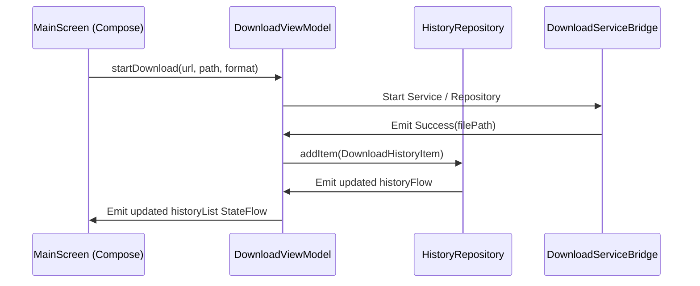

# Phase 02: UI & ViewModel Refactoring
Status: ✅ Completed
Dependencies: [Phase 01: Persistent Local History](file:///d:/skul9x/music-android-main/plans/260620-2026-fix-history-architecture/phase-01-local-history.md)

## Objective
Clean up the architectural boundary between the UI layer (Jetpack Compose) and the Data layer (Repositories). Currently, `MainScreen.kt` instantiates and references `SettingsRepository` and `HistoryRepository` directly using `remember`. We will refactor the codebase to pass all data/state/settings through ViewModels (`DownloadViewModel` and `SettingsViewModel`).

## Requirements

### Functional
- UI must not directly invoke or instantiate `HistoryRepository` or `SettingsRepository`.
- Download success events must trigger automatic insertion of history records in the ViewModel, avoiding duplicate logic and memory leaks.
- App state configurations (like save path and default format) must flow Reactively from `SettingsViewModel` to `MainScreen` without intermediate repository state variables.

### Non-Functional
- **Performance**: Prevent redundant re-renders caused by local repository instances or raw state collections in the UI.
- **Architectural Sanity**: The UI layer should be pure, easily testable, and only depend on ViewModels.
- **Testability**: ViewModel state transitions and automatic history recording on successful downloads must be fully verified using local JVM unit tests.

## Proposed Architectural Flow



## Refactoring Steps

1. **Update `DownloadViewModel.kt`**:
   - Add `historyRepository: HistoryRepository` to the primary constructor.
   - Cache `lastVideoInfo` as a private property inside the ViewModel.
   - Listen to internal download completion (both direct coroutine execution and background service updates via `DownloadServiceBridge`). Upon a transition to `Success`, automatically create a `DownloadHistoryItem` using `lastVideoInfo` and call `historyRepository.addItem()`.
   - Expose the read-only `historyFlow: StateFlow<List<DownloadHistoryItem>>` from the repository directly.
   - Provide a `clearHistory()` function which calls `historyRepository.clearHistory()`.

2. **Update `SettingsViewModel.kt`**:
   - Ensure it exposes all required state flows and update functions for settings so `MainScreen` doesn't need a separate repository reference.

3. **Refactor `MainScreen.kt`**:
   - Add `settingsViewModel: SettingsViewModel` as a parameter.
   - Remove `val settingsRepository = remember { SettingsRepository(context) }` and `val settings by settingsRepository.settingsFlow.collectAsState(...)`.
   - Remove `val historyRepository = remember { HistoryRepository.getInstance() }` and `val historyList by historyRepository.historyFlow.collectAsState()`.
   - Observe settings via `settingsViewModel.settingsState` instead.
   - Observe history via `viewModel.historyFlow` instead.
   - Delegate actions (like save folder selection or clearing history) directly to the respective ViewModel.
   - Remove the `LaunchedEffect(uiState)` block that listens for `Success` to add history items (since this is now handled within the ViewModel).

4. **Update Parent Containers**:
   - Update `AppNavigation.kt` to pass the `settingsViewModel` to `MainScreen`.
   - Update `MainActivity.kt` to initialize the updated `DownloadViewModel` using `HistoryRepository.getInstance(applicationContext)`.

## Files to Create/Modify
- [MODIFY] [DownloadViewModel.kt](file:///d:/skul9x/music-android-main/app/src/main/java/com/musicdownloader/app/ui/viewmodel/DownloadViewModel.kt) - Inject history repo, handle automatic history logging, expose history flow and clear functions.
- [MODIFY] [MainScreen.kt](file:///d:/skul9x/music-android-main/app/src/main/java/com/musicdownloader/app/ui/screens/MainScreen.kt) - Clean repository references, use ViewModel state/methods.
- [MODIFY] [AppNavigation.kt](file:///d:/skul9x/music-android-main/app/src/main/java/com/musicdownloader/app/ui/navigation/AppNavigation.kt) - Connect `settingsViewModel` to `MainScreen`.
- [MODIFY] [MainActivity.kt](file:///d:/skul9x/music-android-main/app/src/main/java/com/musicdownloader/app/MainActivity.kt) - Update ViewModels factories to inject dependencies correctly.
- [MODIFY] [DownloadViewModelTest.kt](file:///d:/skul9x/music-android-main/app/src/test/java/com/musicdownloader/app/ui/viewmodel/DownloadViewModelTest.kt) - Update setup to pass a fake/mocked history repository, and write tests for automatic history additions.

## Test Criteria (File-Based Tests)

To verify the ViewModels and architectural updates, run the JVM Unit Tests:
```bash
./gradlew :app:testDebugUnitTest --tests "com.musicdownloader.app.ui.viewmodel.DownloadViewModelTest"
```

### Test Verifications:
- `startDownload records history item automatically in HistoryRepository on success`
- `fetchInfo saves lastVideoInfo internally in ViewModel`
- `clearHistory delegates call to HistoryRepository`
- Compilation check to confirm that no file inside `ui/screens/` imports or uses `HistoryRepository` or `SettingsRepository` directly (except for model definitions if needed, though they should only reference ViewModels).

---
Next Phase: [phase-03-verification-testing.md](file:///d:/skul9x/music-android-main/plans/260620-2026-fix-history-architecture/phase-03-verification-testing.md)
